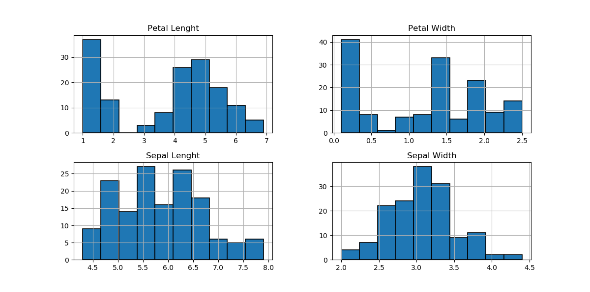
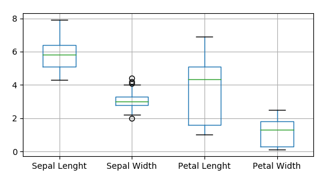
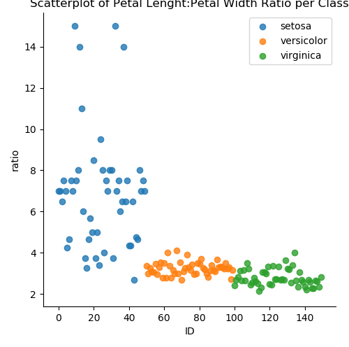
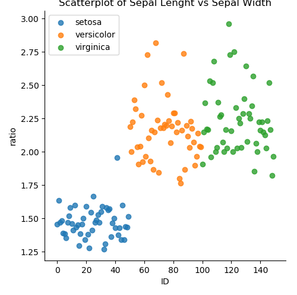
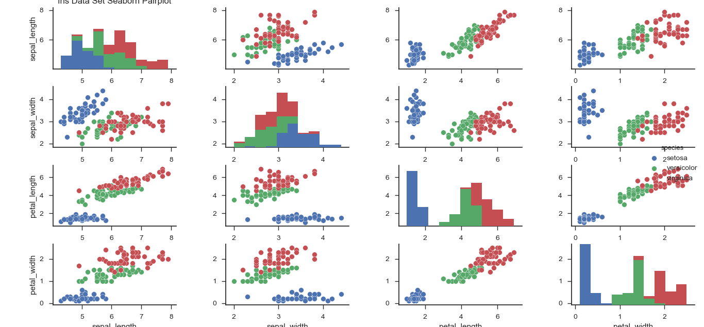

IrisDataSetProject
==========================================================
Background
----------------------------------------------------------
The Iris flower data set or Fisher's Iris data set is a multivariate data set introduced by the British statistician and biologist Ronald Fisher in his 1936 paper The use of multiple measurements in taxonomic problems as an example of linear discriminant analysis.(https://en.wikipedia.org/wiki/Iris_flower_data_set)

  

Originally published at UCI Machine Learning Repository: Iris Data Set, is often used for testing out machine learning algorithms and visualizations (for example, Scatter Plot). Each row of the table represents an iris flower, including its species and dimensions of its botanical parts, sepal and petal, in centimeters.(https://gist.github.com/curran/a08a1080b88344b0c8a7)

For project analysis the data set was imported to visual studio code as a csv file from [UCI Machine Learning Repository](https://archive.ics.uci.edu/ml/datasets/iris)

-------------------------------------------------------------
**Python Libraries Used During Project**

[Matplotlib](https://matplotlib.org/) is a Python 2D plotting library which produces publication quality figures in a variety of hardcopy formats and interactive environments across platforms

[NumPy](https://en.wikipedia.org/wiki/NumPy) is a library for the Python programming language, adding support for large, multi-dimensional arrays and matrices, along with a large collection of high-level mathematical functions to operate on these arrays.

[Pandas](http://pandas.pydata.org/) is a ptython library for dealing with structured or tabular data.

[Seaborn](https://seaborn.pydata.org/) is a Python visualization library based on matplotlib. It provides a high-level interface for drawing attractive statistical graphics.

--------------------------------------------------------------
**Command Shell**

[IPython](https://en.wikipedia.org/wiki/IPython) is a command shell for interactive computing in multiple programming languages, originally developed for the Python programming language, that offers introspection, rich media, shell syntax, tab completion, and history.

---------------------------------------------------------------
**Files In The Repository**

*Project.py*
Uses pandas to attribute the 5 columns within the iris.csv file with relevant column headings - Sepal Length, Sepal Width, Petal Length, Petal Width and Class

Dataset basic information was generated using pandas and ipython outputting:
150 rows
5 columns

A [Histogram]((https://matplotlib.org/gallery/statistics/histogram_features.html)) matrix was created to show visual representation of the distribution of data for Sepal Lenght, Sepal Width, Petal Lenght and Petal Width

[Boxplots](https://matplotlib.org/api/_as_gen/matplotlib.pyplot.boxplot.html) was generated to graphically represent the data through their quartiles. The horizontal line represents the median of the data set. The whiskers of the boxplot extends to the min and max of the data outside the upper and lower quartiles. Outliers are identified in Sepal Width. There is visibility of the skewness of the data. 

Scatter plots were created to display the correlation between petal lenght and petal width for the three different class types. [Reference source](https://stackoverflow.com/questions/45862223/use-different-colors-in-scatterplot-for-iris-dataset)

[Seaborn](https://stackoverflow.com/questions/46383645/seaborn-and-pd-scatter-matrix-plot-color-issues)

