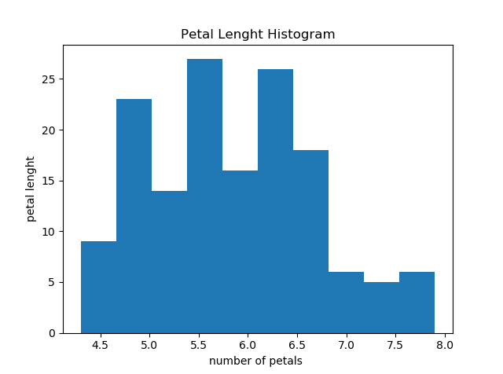

IrisDataSetProject
==========================================================
Background
----------------------------------------------------------

The dataset contains a set of 150 records under 5 attributes - Petal Length , Petal Width , Sepal Length , Sepal width and Class.

[NumPy](http://www.numpy.org/)

Creating Histograms
[Histograms](https://matplotlib.org/gallery/statistics/histogram_features.html)

Creating boxplots
[Boxplots](https://matplotlib.org/api/_as_gen/matplotlib.pyplot.boxplot.html)

