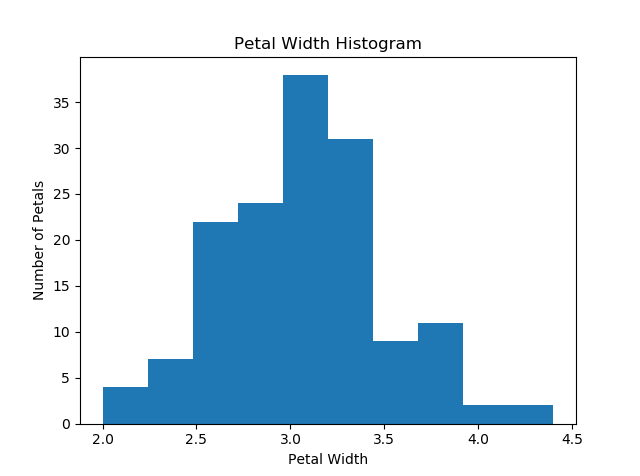
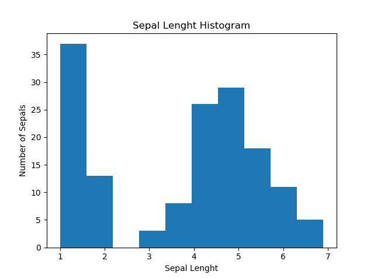
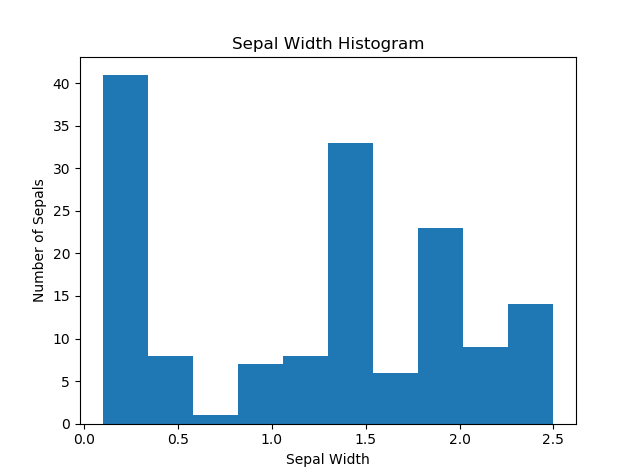

IrisDataSetProject
==========================================================
Background
----------------------------------------------------------

The dataset contains a set of 150 records under 5 attributes - Petal Length , Petal Width , Sepal Length , Sepal width and Class.

[NumPy](https://en.wikipedia.org/wiki/NumPy)is a library for the Python programming language, adding support for large, multi-dimensional arrays and matrices, along with a large collection of high-level mathematical functions to operate on these arrays.

[IPython](https://en.wikipedia.org/wiki/IPython) is a command shell for interactive computing in multiple programming languages, originally developed for the Python programming language, that offers introspection, rich media, shell syntax, tab completion, and history.

Creating Histograms
[Histograms](https://matplotlib.org/gallery/statistics/histogram_features.html)

Creating boxplots
[Boxplots](https://matplotlib.org/api/_as_gen/matplotlib.pyplot.boxplot.html)
