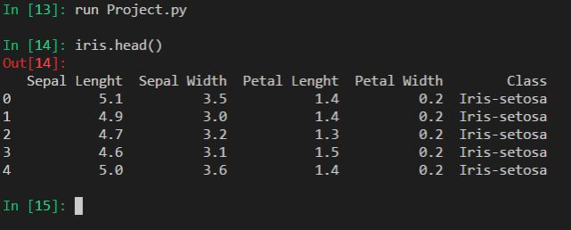

IrisDataSetProject
==========================================================
Background
----------------------------------------------------------
The Iris flower data set or Fisher's Iris data set is a multivariate data set introduced by the British statistician and biologist Ronald Fisher in his 1936 paper The use of multiple measurements in taxonomic problems as an example of linear discriminant analysis.(https://en.wikipedia.org/wiki/Iris_flower_data_set)

  

Originally published at UCI Machine Learning Repository: Iris Data Set, is often used for testing out machine learning algorithms and visualizations (for example, Scatter Plot). Each row of the table represents an iris flower, including its species and dimensions of its botanical parts, sepal and petal, in centimeters.(https://gist.github.com/curran/a08a1080b88344b0c8a7)

For project analysis the data set was imported to visual studio code as a csv file from [UCI Machine Learning Repository](https://archive.ics.uci.edu/ml/datasets/iris)

-------------------------------------------------------------
**Python Libraries Used During Project**

[Matplotlib](https://matplotlib.org/) is a Python 2D plotting library which produces publication quality figures in a variety of hardcopy formats and interactive environments across platforms

[NumPy](https://en.wikipedia.org/wiki/NumPy) is a library for the Python programming language, adding support for large, multi-dimensional arrays and matrices, along with a large collection of high-level mathematical functions to operate on these arrays.

[Pandas](http://pandas.pydata.org/) is a ptython library for dealing with structured or tabular data.

[Seaborn](https://seaborn.pydata.org/) is a Python visualization library based on matplotlib. It provides a high-level interface for drawing attractive statistical graphics.

--------------------------------------------------------------
**Command Shell**

[IPython](https://en.wikipedia.org/wiki/IPython) is a command shell for interactive computing in multiple programming languages, originally developed for the Python programming language, that offers introspection, rich media, shell syntax, tab completion, and history.

---------------------------------------------------------------
**Files In The Repository**

*Irisdataset.py*
Uses NumPy and ipython to calculate the mean, minimum, maximum and standard deviation of the Sepal Lenght, Sepal Width, Petal Lenght and Petal Width

*Project.py*
Uses pandas to attribute the 5 columns within the iris.csv file with relevant column headings -
Sepal Length, Sepal Width, Petal Length, Petal Width and Class

Basic statisical information was generated about the data set using pandas and ipython outputting:
150 rows
5 columns

A [Histogram]((https://matplotlib.org/gallery/statistics/histogram_features.html)) matrix was created to show visual representation of the distribution of data for Sepal Lenght, Sepal Width, Petal Lenght and Petal Width. This is an efficient graphical display to show the spread of data across the 4 attributes. 

[Boxplots](https://matplotlib.org/api/_as_gen/matplotlib.pyplot.boxplot.html) were generated to graphically represent the data through their quartiles. The horizontal line represents the median of the data set. The whiskers of the boxplot extends to the min and max of the data outside the upper and lower quartiles. Outliers are identified in Sepal Width. There is visibility of the skewness of the data. 

*Scatterplot.py*

Scatter plots were created to display the correlation between petal lenght and petal width and for sepal lenght and sepal width for the three different class types. The variance within the species is evident from the colour representations. [Reference source](https://stackoverflow.com/questions/45862223/use-different-colors-in-scatterplot-for-iris-dataset)

For the setosa species, the ratio of petal lenght:petal width is greater than the other 2 species

Whereas in relation to sepal lenght:width ratio the setosa is more tightly aligned than the versicolor and verginica species

*SeabornPairplot.py*

[Seaborn](https://stackoverflow.com/questions/46383645/seaborn-and-pd-scatter-matrix-plot-color-issues) was used to create a pairplot. This is a matrix of graphs to cross reference the class of flower per variables. ie. for the species setosa, versicolor and verginica there is a total of 12 graphs cross referencing the sepal lenght, sepal width, petal lenght and petal width to identify effeciently if there is any correlation or regression within the data

----------------------------------------------------------
**References**

Various methods for analysis and scripting werew considered during the project. Final decision on alaysis format was based on applicability to the desired output. As the analysis was not giving the desired output using NumPy and matplotlib solely, knowledge of Pandas and seaborn was enhanced to generate efficient and interesting visual representations. 
See below information sources utilised throught the project duration

General Analysis
https://stackoverflow.com/questions/7661540/print-the-first-two-rows-of-a-csv-file-to-a-standard-output
https://stackoverflow.com/questions/16503560/read-specific-columns-from-a-csv-file-with-csv-module
https://docs.python.org/3.1/library/csv.html
https://docs.python.org/2/library/csv.html
https://stackoverflow.com/questions/2121839/rstrip-not-removing-newline-char-what-am-i-doing-wrong
https://www.kaggle.com/mathewnik90/machinelearning-helloworld-with-iris-full-analysis/notebook
https://davetang.org/muse/2012/01/26/using-r-to-obtain-basic-statistics-on-your-dataset/
http://www.pythonforbeginners.com/dictionary/python-split
https://www.w3resource.com/python-exercises/re/python-re-exercise-47.php
https://stackoverflow.com/questions/14494747/add-images-to-readme-md-on-github
https://stackoverflow.com/questions/10189356/how-to-add-screenshot-to-readmes-in-github-repository
McKinney, Wes, *Python for Data Analysis*, 2nd Edition O'Reilly,2017.

Scatterplots
https://stackoverflow.com/questions/45862223/use-different-colors-in-scatterplot-for-iris-dataset
https://github.com/venky14/Machine-Learning-with-Iris-Dataset/blob/master/Machine%20Learning%20with%20Iris%20Dataset.ipynb
https://stackoverflow.com/questions/7941207/is-there-a-function-to-make-scatterplot-matrices-in-matplotlib

Boxplots
https://pandas.pydata.org/pandas-docs/stable/generated/pandas.DataFrame.boxplot.html
http://seaborn.pydata.org/examples/grouped_boxplot.html
https://machinelearningmastery.com/machine-learning-in-python-step-by-step/
https://matplotlib.org/gallery/pyplots/boxplot_demo_pyplot.html#sphx-glr-gallery-pyplots-boxplot-demo-pyplot-py
https://matplotlib.org/api/_as_gen/matplotlib.pyplot.boxplot.html

pandas
https://pandas.pydata.org/pandas-docs/stable/generated/pandas.DataFrame.html
https://chrisalbon.com/python/data_wrangling/pandas_dataframe_importing_csv/
https://gist.github.com/curran/a08a1080b88344b0c8a7

Seaborn
https://github.com/mwaskom/seaborn-data
https://stackoverflow.com/questions/26597116/seaborn-plots-not-showing-up
https://stackoverflow.com/questions/46383645/seaborn-and-pd-scatter-matrix-plot-color-issues
https://seaborn.pydata.org/generated/seaborn.pairplot.html

----------------------------------------------------------
**Licience**

Apache License 2.0 A permissive license whose main conditions require preservation of copyright and license notices. Contributors provide an express grant of patent rights. Licensed works, modifications, and larger works may be distributed under different terms and without source code

